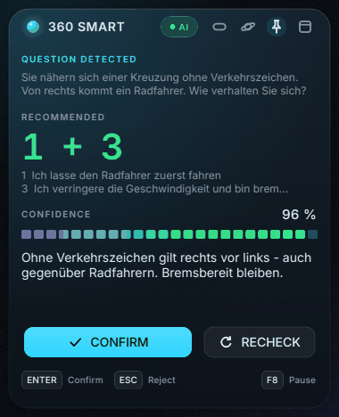
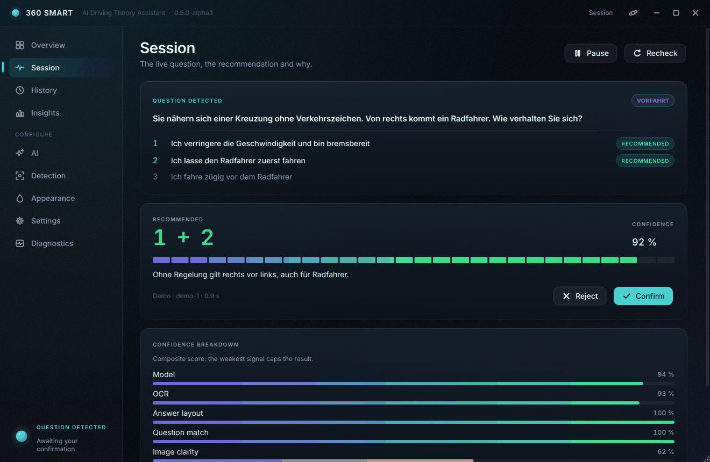
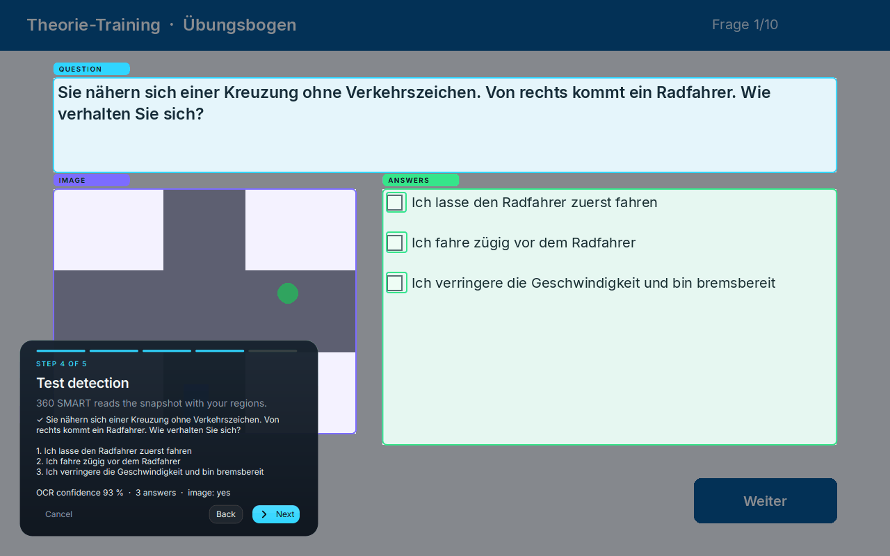

# 360 SMART
**AI Driving Theory Assistant** · Windows + iOS · Version 0.5.0-alpha.1

<p align="center">
  
  
</p>

> **Status: 0.5 alpha.** Kernfunktionen sind implementiert und automatisiert getestet (Linux, echtes OCR,
> Ende-zu-Ende gegen einen Übungssimulator). Die Windows-spezifischen Teile und der Installer werden per CI auf
> einem echten Windows-Rechner gebaut und getestet. Gegen die echte „360° online“-Software und auf einem
> echten iPhone wurde **noch nicht** getestet. Details stehen in [`docs/FINAL_STATUS.md`](docs/FINAL_STATUS.md).

---

## Overview

360 SMART ist ein Lernbegleiter für die Führerschein-Lernsoftware **„360° online“** (DEGENER). Er erkennt die
angezeigte Frage, liest Antworten und Situationsbild, empfiehlt die wahrscheinlich richtige Antwort mit
**Confidence** und **kurzer Begründung** und merkt sich deine Problemfragen.

**Grundregel: Nichts passiert ohne dich.** Auf Windows wird eine Auswahl nur nach deiner ausdrücklichen
Bestätigung ausgeführt. Das erzwingt die State Machine technisch (siehe [Architecture](#architecture)).
Auf iOS kann keine App in einer anderen App tippen; dort ist 360 SMART rein beratend.

360 SMART ist ein **Lernwerkzeug**. Es erklärt die Regel hinter jeder Antwort, damit du sie verstehst. In der
amtlichen Theorieprüfung ist es weder nutzbar noch erlaubt. Kein Produkt von oder verbunden mit DEGENER Verlag.

## Features

| | Windows | iOS |
|---|---|---|
| Frage automatisch erkennen | ✅ Fenster-Erkennung + Change Detection | ✅ Live-Broadcast, Screenshot, Teilen, Kurzbefehl |
| OCR | Windows OCR (eingebaut) / Tesseract | Apple Vision (on-device) |
| Bildverständnis (Verkehrszeichen, Situationen) | ✅ Vision-Modell | ✅ Vision-Modell |
| Empfehlung + Composite Confidence + Begründung | ✅ | ✅ |
| Ausführung nach Bestätigung (Klick + visuelle Prüfung, max. 3 Versuche) | ✅ | ➖ (iOS erlaubt das nicht) |
| Intelligenter Cache (Zahlen-, Wort-, Bild- und Antwort-Checks) | ✅ | ✅ |
| History, Suche, Filter, Insights, Problemfragen | ✅ | ✅ |
| Overlay: Full · Focus · **Orbit** | ✅ | Benachrichtigungen |
| Health Monitor, Self-Recovery, Diagnose-Export | ✅ | teilweise |
| Provider: Anthropic Claude · OpenAI · Google Gemini · Demo | ✅ | ✅ (ohne Demo) |

## Architecture

```
 Capture ─► Change Detection ─► OCR + Parser ─► Cache ─► AI (structured JSON) ─► Composite Confidence
    ▲                                                                                  │
    │                         State Machine (einzige Tür: approve_question) ◄──────────┘
    │                                    │ ApprovalToken (einmalig, an Frage + Generation gebunden)
    └──── Verify ◄── Click (atomar, Fenster-geprüft) ◄── erneute Frage-Prüfung ◄── Antwort per TEXT finden
```

Ausführlich: [`docs/ARCHITECTURE.md`](docs/ARCHITECTURE.md) · Entscheidungen: [`docs/DECISIONS.md`](docs/DECISIONS.md)
· Recherche: [`docs/RESEARCH.md`](docs/RESEARCH.md)

## Windows Setup

**Installer (empfohlen):** `360SmartSetup.exe` ausführen. Ein Python-Setup ist nicht nötig, und Admin-Rechte
werden nicht gebraucht (Installation pro Benutzer). Der Installer entsteht im CI-Workflow
[`windows.yml`](.github/workflows/windows.yml) als Artefakt „360SmartSetup“ oder lokal mit:

```powershell
cd windows
powershell -ExecutionPolicy Bypass -File packaging\build.ps1   # braucht Python 3.11+ und Inno Setup 6 (nur zum Bauen)
```

Windows SmartScreen zeigt beim ersten Start „Unbekannter Herausgeber“ an, weil der Installer nicht signiert ist
(Code-Signing-Zertifikate kosten Geld, siehe [RELEASE](docs/RELEASE.md)). Klicke auf „Weitere Informationen“ und
dann „Trotzdem ausführen“.

**Starten:** Startmenü → *360 SMART*. Zum Ausprobieren ohne Lernsoftware und ohne API-Key gibt es
*360 SMART (Demo)*; das öffnet einen eingebauten Übungssimulator.

**Aus dem Quellcode (Entwicklung):**
```powershell
cd windows
python -m venv .venv; .venv\Scripts\activate
pip install -e ".[dev,windows]"
python -m smart360 --demo
```

## iOS Setup

Voraussetzungen: ein Mac mit **Xcode 16+**, `brew install xcodegen`, ein iPhone mit **iOS 17+**.

| Variante | Apple-Konto | Funktionen |
|---|---|---|
| `project.yml` | **Apple Developer Program (99 €/Jahr)** | App + Live-Broadcast + Teilen + Kurzbefehl |
| `project-free.yml` | kostenloses Apple-Konto | App (Screenshot-Analyse) + Kurzbefehl. Die App läuft nur **7 Tage**, danach neu installieren |

App Groups und Keychain Sharing, die die Extensions benötigen, gibt es laut Apple nur für zahlende
Developer-Program-Mitglieder.

```bash
cd ios
xcodegen generate                        # oder: xcodegen generate --spec project-free.yml
open Smart360.xcodeproj                  # Signing & Capabilities → Team wählen → auf dem iPhone ausführen
```

Einmalig auf dem iPhone: *Einstellungen → Allgemein → VPN & Geräteverwaltung → Entwickler-App vertrauen*.
Dann in der App unter *Settings* den API-Key eintragen (er wird im iOS-Schlüsselbund gespeichert).

**Die drei Arbeitsweisen auf dem iPhone:**
1. **Live:** Home → *Live analysis* → Aufnahme-Button → *360 SMART* → *Übertragung starten*. Danach in die
   360°-App wechseln. Jede neue Frage erscheint als Mitteilung („1 + 3 · 96 %“) mit *Confirm/Reject*.
2. **Screenshot:** Screenshot machen → 360 SMART → *START ANALYSIS*.
3. **Kurzbefehl / Back Tap:** Kurzbefehle-App → „Bildschirmfoto aufnehmen“ → „Analyze Screenshot“ (360 SMART).
   Optional: *Bedienungshilfen → Tippen → Auf Rückseite tippen*.

## AI Providers

| Provider | Standardmodell | Key | Hinweis |
|---|---|---|---|
| Anthropic | `claude-opus-5-5` (effort `low`) | `ANTHROPIC_API_KEY` | Standard. Structured Outputs, Refusal-Fallback |
| OpenAI | `gpt-6-luna` | `OPENAI_API_KEY` | Implementiert, **nicht live getestet** |
| Google Gemini | `gemini-3.8-flash` | `GEMINI_API_KEY` | Implementiert, **nicht live getestet** |
| Demo | offline | – | nur für den Übungssimulator |

Kosten entstehen pro Anfrage beim Anbieter. Überschlag für Opus 5.5 (4 $ / 20 $ pro Mio. Input-/Output-Tokens):
eine Frage mit Bild hat ca. 2.000 Input- und 300–800 Output-Tokens, also **ca. 1,5–2,5 Cent**. Sonnet 5.5 kostet
etwa die Hälfte, Haiku 4.5 etwa ein Viertel (einstellbar unter *AI*). Der Cache beantwortet wiederholte Fragen
kostenlos. Die Nutzung wird lokal geschätzt (*AI → Local usage estimate*);
es gibt keine Telemetrie.

## Calibration

*Detection → Calibrate new profile* (oder Schritt 3 im Onboarding): Frage-Bereich, Antwort-Bereich (inkl.
Checkboxen), optional Bild- und „Weiter“-Bereich ziehen. Danach *Test detection* mit Live-Ergebnis, dann
*Save* (z. B. „Laptop“, „Desktop“, „Fullscreen“). Die Bereiche werden relativ zum Fenster gespeichert, sodass
Verschieben und Größenänderung weiter funktionieren. Bei mehreren Profilen wählt 360 SMART automatisch das
passende.



## Hotkeys

| Taste | Aktion | Hinweis |
|---|---|---|
| `ENTER` | Bestätigen | global **nur**, solange eine Frage auf Bestätigung wartet; bei „Manual check“ deaktiviert |
| `ESC` | Ablehnen | global nur während der Bestätigung |
| `F8` | Pause / Fortsetzen | |
| `F9` | Neu analysieren (ohne Cache) | |
| `Ctrl+Shift+M` | Overlay-Modus wechseln (Full → Focus → Orbit) | |
| `Ctrl+Shift+Q` | Beenden | |

## Privacy

Screenshots bleiben **nur im Arbeitsspeicher** und werden nach der Analyse verworfen. An den gewählten
AI-Anbieter gehen nur die Ausschnitte der aktuellen Frage. History und Cache liegen lokal
(`%APPDATA%\360Smart`, iOS: App-Container). API-Keys liegen in der Windows-Anmeldeinformationsverwaltung bzw.
im iOS-Schlüsselbund und werden nie geloggt. Details: [`docs/PRIVACY.md`](docs/PRIVACY.md) ·
[`docs/SECURITY.md`](docs/SECURITY.md)

## Troubleshooting

| Problem | Lösung |
|---|---|
| „Looking for the 360° window…“ | 360° online im Browser öffnen. Passt der Fenstertitel nicht, unter *Detection → Window title patterns* anpassen |
| „Calibration required“ | *Detection → Calibrate new profile* |
| „AI OFFLINE“ | Internet prüfen. Nach wiederholten Fehlern pausiert der Circuit Breaker 30 s, danach neuer Versuch |
| „API key missing / rejected“ | *AI → API key* neu speichern und *Test connection* ausführen |
| „not clicked: another window covers the answer“ | Das Overlay liegt über der Antwort. Overlay verschieben oder Orbit-Modus nutzen |
| Klick landet falsch bei 125/150 % Skalierung | Neu kalibrieren. 360 SMART ist per-Monitor-DPI-aware |
| ENTER funktioniert nicht | Bei „Manual check“ ist ENTER absichtlich aus. Oder eine andere App belegt die Taste (*Diagnostics*) |
| SmartScreen-Warnung | siehe [Windows Setup](#windows-setup) |

## Diagnostics

*Diagnostics* zeigt den Zustand aller Subsysteme (HEALTHY / DEGRADED / RECOVERING / FAILED), Latenzen
(AI, OCR, Capture, Aktion, UI-Lag), CPU/RAM/Speichertrend, die letzten Fehler, einen **Self-Test** und
**Export report**: eine anonymisierte JSON-Datei ohne API-Keys, ohne Fragetexte und ohne Screenshots.
Kommandozeile: `360Smart.exe --self-test` (Exit-Code 1 bei Fehlern).

## Development

```bash
cd windows
pip install -e ".[dev]"
ruff check smart360 tests tools && mypy smart360
QT_QPA_PLATFORM=offscreen pytest            # 134 Tests, inkl. Ende-zu-Ende mit echtem Tesseract-OCR
python tools/screenshots.py                 # alle Screens rendern (Visual Review)
python tools/ocr_benchmark.py               # OCR-Benchmark
python tools/soak.py --minutes 30           # Langzeit-/Speichertest
cd ../ios/Packages/Smart360Core && swift test   # (macOS)
```

Tests: [`docs/TESTING.md`](docs/TESTING.md)

## Release

Versionierung: 0.1 development → **0.5 alpha (jetzt)** → 0.9 beta → 1.0 erst nach erfüllter Release-Checkliste.
Build, Signierung und Checkliste: [`docs/RELEASE.md`](docs/RELEASE.md) · Ehrlicher Stand:
[`docs/FINAL_STATUS.md`](docs/FINAL_STATUS.md)
