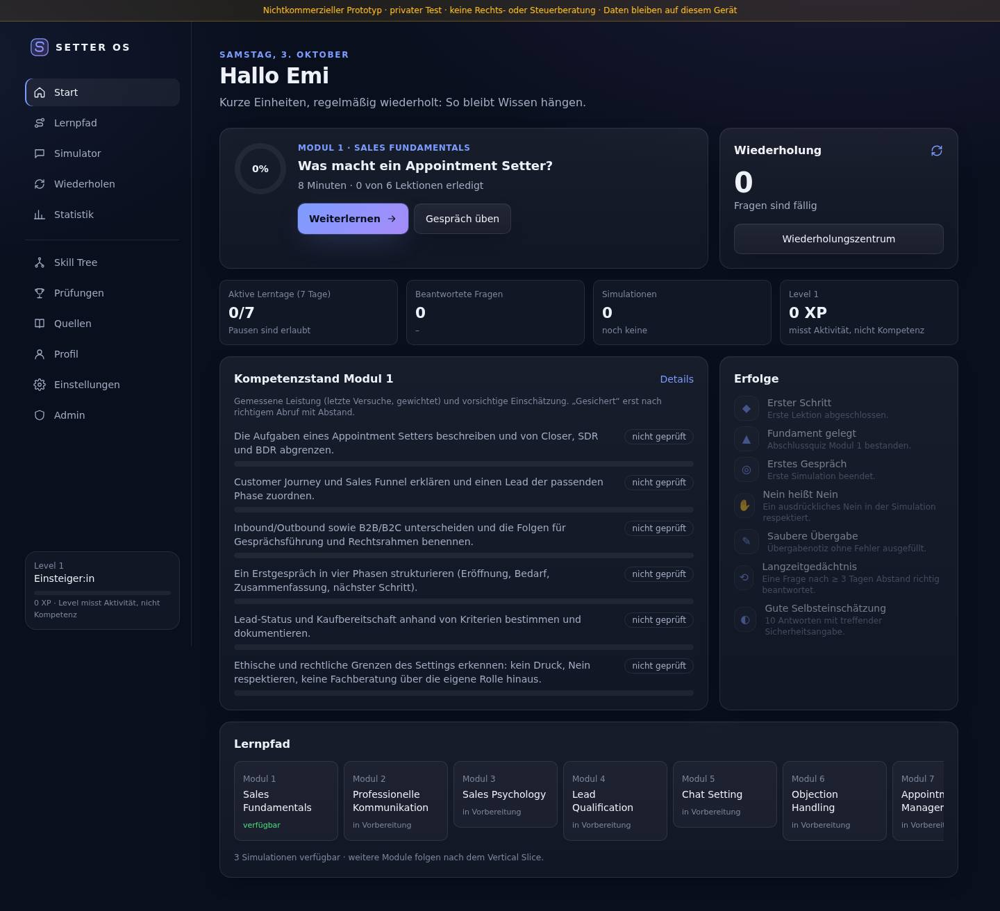
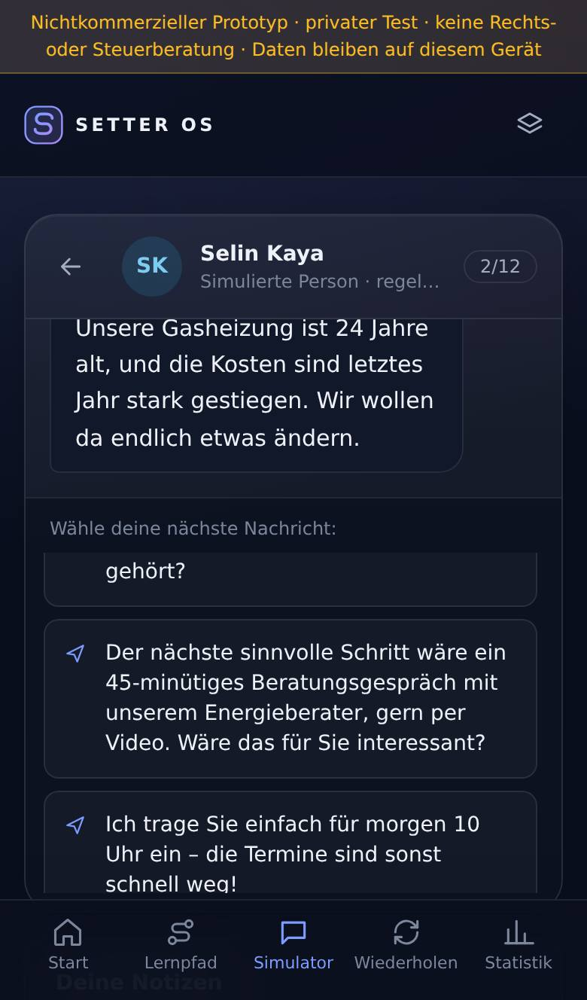

# SETTER OS ACADEMY

**Learn the skill. Master the conversation.** · Version `0.1.0-slice` · Stand 03.10.2026

> **Status: nichtkommerzieller, privat getesteter Prototyp (Vertical Slice).** Keine Zahlungsfunktion, keine Verkaufsversprechen, keine Server, keine Cloud-Konten. Vor jeder kommerziellen Nutzung gilt das [Legal-Review-Gate](docs/LEGAL_REVIEW_CHECKLIST.md) – insbesondere die mögliche **ZFU-Zulassungspflicht nach FernUSG** (BGH III ZR 109/24 u. a.). Der Name ist ein Arbeitstitel.

<p>


</p>

## Was funktioniert (getestet)

| Bereich | Umfang |
|---|---|
| Lerninhalte | Modul 1 „Sales Fundamentals“ vollständig: 6 Lektionen, Worked Examples, 2 Fallstudien, Transferaufgabe; Lehrplan für alle 12 Module |
| Quiz-Engine | 11 Fragetypen, 30 geprüfte Fragen mit Erklärung, Quelle, Denkfehler je Distraktor; Abschlussquiz (gemischt, ≥ 80 %) |
| Kundensimulator | 3 Szenarien (Termin sinnvoll / Disqualifizierung / ausdrückliches Nein), verborgene Informationen, mehrere Verläufe, Übergabenotiz |
| AI Sales Coach (deterministisch) | 11 gewichtete Kompetenzen, harte Grenzen (Druck, falsche Versprechen, unqualifizierte Termine, erfundene Notizen), 3 Stärken, 3 Verbesserungen, Schlüsselstellen, bessere Beispielantwort, Wiederholungsübung |
| Lernsystem | Leitner-Wiederholung mit Interleaving, Sicherheitsangabe, gemessene Leistung getrennt von Kompetenzeinschätzung |
| Gamification | XP/Level/Erfolge ohne Strafen, aktive Tage statt brechender Serie, Lernpause |
| Ansichten | Landing, Registrierung, Login, Dashboard, Lernpfad, Modul, Lektion, Quiz, Simulator, Auswertung, Wiederholung, Statistik + Fehleranalyse, Skill Tree, Prüfungen (+ Master-Spezifikation), Quellenbibliothek, Profil, Einstellungen, Admin/Content Studio |
| Design | Dark-first „Deep Focus“, Light Mode, Reduced Motion, Mobile-first (iPhone-Tableiste, Safe Areas) |
| Daten | lokal im Browser, versioniert + Migrationen, Export/Import/Löschen; PostgreSQL-Zielschema getestet |

## Schnellstart

Voraussetzung: Node.js ≥ 20.

```bash
cd setter-os-academy
npm install
npm run dev            # Entwicklung: http://localhost:3000
npm run build          # statischer Export nach ./out
npm start              # ./out lokal ausliefern (npx serve)
```

Auf dem iPhone im selben WLAN testen: `npm run dev -- -H 0.0.0.0`, dann `http://<IP-des-Laptops>:3000` öffnen.

### Tests

```bash
npm run typecheck      # TypeScript strict
npm test               # 119 Unit-/Regressions-/Schema-Tests (Vitest, PGlite)
npm run build && npm run test:e2e   # Playwright: Desktop + iPhone-Viewport, axe WCAG 2.2 AA
npm run test:all       # alles nacheinander
npm run gen:sources    # docs/SOURCE_REGISTER.md aus content/sources.json erzeugen
npm run screenshots    # Referenz-Screenshots (Server auf :4173 muss laufen)
```

Playwright nutzt das vorinstallierte Chromium; WebKit/echtes Safari wurde **nicht** getestet.

## Struktur

```
content/      Lerninhalte als JSON (Quellen, Wissensdatenbank, Lehrplan, Modul 1, Fragen, Szenarien)
src/lib/      Engines (quiz, review, customer, coach, gamification), Store, Validator
src/app/      Ansichten (Next.js App Router, Static Export)
src/components/  Designsystem, QuestionRenderer, AppShell
db/schema.sql PostgreSQL-Zielschema (Supabase-tauglich)
tests/ e2e/   Vitest- und Playwright-Tests
docs/         Projektdokumentation (s. u.)
```

## Dokumentation

[PROJECT_VISION](docs/PROJECT_VISION.md) · [RESEARCH_REPORT](docs/RESEARCH_REPORT.md) · [SOURCE_REGISTER](docs/SOURCE_REGISTER.md) · [CURRICULUM](docs/CURRICULUM.md) · [LEARNING_SCIENCE](docs/LEARNING_SCIENCE.md) · [DESIGN_SYSTEM](docs/DESIGN_SYSTEM.md) · [TECHNICAL_ARCHITECTURE](docs/TECHNICAL_ARCHITECTURE.md) · [DATABASE_SCHEMA](docs/DATABASE_SCHEMA.md) · [SIMULATION_ENGINE](docs/SIMULATION_ENGINE.md) · [QUIZ_ENGINE](docs/QUIZ_ENGINE.md) · [ASSESSMENT_RUBRIC](docs/ASSESSMENT_RUBRIC.md) · [TEST_PLAN](docs/TEST_PLAN.md) · [LEGAL_REVIEW_CHECKLIST](docs/LEGAL_REVIEW_CHECKLIST.md) · [CONTENT_GUIDELINES](docs/CONTENT_GUIDELINES.md) · [PRODUCT_ROADMAP](docs/PRODUCT_ROADMAP.md) · [MONETIZATION](docs/MONETIZATION.md) · [CHANGELOG](docs/CHANGELOG.md) · [OPEN_QUESTIONS](docs/OPEN_QUESTIONS.md) · [Rechtsentwürfe](docs/legal-drafts/)

## Ehrliche Grenzen dieser Version

- Recherche: Primärtexte (Gesetze, Urteile, Studien) waren in der Arbeitsumgebung **nicht abrufbar**; Aussagen sind über Websuche/Sekundärquellen abgeglichen und entsprechend markiert.
- Module 2–12 sind geplant, aber noch nicht ausgearbeitet (30 von ≥ 150 Fragen, 3 von ≥ 20 Szenarien).
- Kein echtes Konto/Login, keine Rollenrechte, keine KI-Anbindung, kein Test auf echtem iPhone.
- Rechtliche Inhalte sind Lernmaterial, keine Rechtsberatung.
